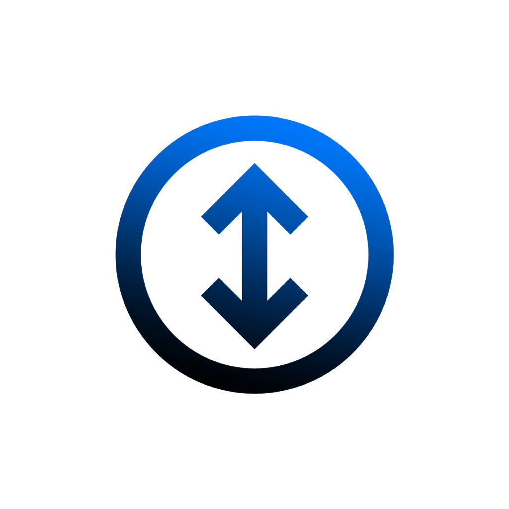

# Scrollapp

A macOS utility that brings Windows-style auto-scrolling to macOS. Middle-click anywhere to enable auto-scroll mode, then move your cursor to control scrolling speed and direction.

## Features

- **Windows-style Auto-scrolling**: Middle-click to activate, move cursor to control scrolling
- **Multiple Activation Methods**: Use mouse middle-click or Option+Scroll on trackpads
- **Intuitive Controls**: Move cursor up/down to control scroll direction and speed
- **Customizable Direction**: Option to invert scrolling direction based on preference
- **Menu Bar Integration**: Quick access via status menu in the menu bar

## Installation

1. **Download**: Download the latest release from the [Releases](https://github.com/fromis-9/scrollapp-beta/releases) page
2. **Install**: Open the DMG file and drag Scrollapp to your Applications folder
3. **First Launch**: 
   - Try to open the app by double-clicking it
   - If you see a security warning that the app "cannot be opened because it is from an unidentified developer"
   - Open System Settings (or System Preferences)
   - Go to Privacy & Security
   - Scroll down and look for the message about Scrollapp
   - Click the "Open Anyway" button 
   - When the warning prompt reappears, click "Open"
4. **Grant Permissions**:
   - When prompted, allow Scrollapp to monitor input events
   - If you miss this prompt, go to System Settings > Privacy & Security > Input Monitoring
   - Ensure Scrollapp is checked in the list of allowed apps
   - You may need to restart the app after granting permissions

## How to Use

### Activating Auto-scroll

**With Mouse:**
- Middle-click anywhere to enable auto-scroll mode
- Middle-click again or click any mouse button to exit auto-scroll mode

**With Trackpad:**
- Hold Option key and perform a two-finger scroll to activate auto-scroll
- Click anywhere to exit auto-scroll mode

### Controlling Scrolling

Once auto-scroll is activated:
- Move cursor **up** to scroll **up**
- Move cursor **down** to scroll **down**
- Move further from the center point for faster scrolling
- Move closer to the center point for slower, more precise scrolling

### Menu Options

Access additional options from the menu bar icon:
- Start/Stop Auto-Scroll
- Invert Scrolling Direction
- About Scrollapp

## System Requirements

- macOS 11.0 (Big Sur) or later
- Mouse with middle button or trackpad support

## Privacy

Scrollapp requires Input Monitoring permissions to detect mouse/trackpad events. It does not collect or transmit any personal data.

## License

[GNU General Public License v3.0](LICENSE)

## Feedback and Contributions

Feedback and contributions are welcome! Please feel free to submit issues or pull requests.